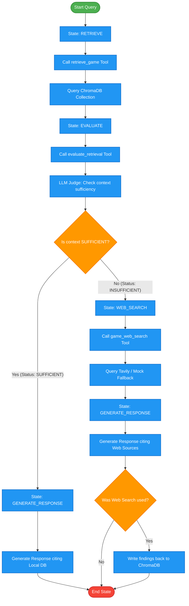

# Technical Architecture & Technology Decisions: UdaPlay

This document explains the technical architecture, design decisions, and technology choices behind **UdaPlay**, an AI Research Agent built for the video game industry.

---

## 1. The Technology Stack & "Why" Behind Each Choice

To solve the requirements of local game search, quality evaluation, and web fallback search, we selected a specialized set of technologies. Below is the rationale for each tool, backed by general and project-specific examples.

### A. Vector Database: ChromaDB
* **Why**: Traditional relational databases (SQL) or text-search systems (ElasticSearch) rely on exact keyword matches. ChromaDB is a lightweight, persistent vector database designed specifically for AI embeddings.
* **Project Example**: 
  * If a user asks: *"Which one was the first 3D platformer Mario game?"*
  * A traditional SQL query like `SELECT * FROM games WHERE description LIKE '%3D platformer%'` would fail if the description for *Super Mario 64* says: *"Features three-dimensional gameplay where players explore open worlds, setting the standard for 3D game design."* (Note that the exact phrase "3D platformer" is missing).
  * **ChromaDB** resolves this by checking the semantic similarity, understanding that *"three-dimensional gameplay"* is conceptually matching *"3D platformer"*, and retrieves *Super Mario 64* as the top result.

### B. Text Embeddings: OpenAI `text-embedding-3-small`
* **Why**: Text embeddings translate natural language strings into high-dimensional numerical vectors (1,536 dimensions) where similar concepts lie close together. We selected OpenAI's `text-embedding-3-small` because of its high semantic accuracy, support for multi-language synonyms, and low latency.
* **Project Example**:
  * The query *"Who developed Pokémon Red?"* yields a vector coordinate close to the document vector for *Pokémon Ruby and Sapphire* and *Pokémon Gold and Silver*.
  * The database checks these close neighbors, extracts the publisher/developer metadata (e.g. *Game Freak* and *Nintendo*), and passes it to the agent.

### C. Large Language Model: OpenAI GPT-4o-Mini
* **Why**: The agent requires a model capable of:
  1. Operating as a **Judge** (evaluating whether RAG retrieved enough facts).
  2. Maintaining state and conversation history.
  3. Synthesizing final formatted reports citing sources.
  `gpt-4o-mini` offers the perfect balance of advanced reasoning, strict JSON output compliance (crucial for evaluation checks), fast completion, and budget efficiency.

### D. Web Search Engine: Tavily API
* **Why**: Standard Google/Bing search APIs return raw HTML pages, ads, and navigation bars, which clutter the LLM context and waste tokens. Tavily is a search engine built specifically for LLMs and AI agents, returning clean, summarized paragraphs and source URLs directly matching the query intent.
* **Project Example**:
  * Query: *"What is Rockstar Games working on right now?"*
  * Since our pre-loaded game dataset only covers historical releases (up to ~2022/2023), it doesn't contain current live details about GTA VI.
  * The RAG search returns only past titles (like *GTA: San Andreas*). The evaluation tool identifies this retrieved context as `INSUFFICIENT`.
  * The agent falls back to **Tavily**, which performs a real-time web search, finds articles from late 2025/2026, and returns: *"Rockstar Games is currently developing Grand Theft Auto VI (GTA 6), set to release in Fall 2025."*

---

## 2. Stateful Agent Workflow Diagram

The agent's decision logic is implemented as a state machine. It attempts local retrieval first, evaluates the quality, and falls back to a web search only when necessary.

---

## 3. Core Component Transitions

1. **State `START`**:
   * Initializes query structure and reads user message.
2. **State `RETRIEVE`**:
   * Triggers the `retrieve_game` tool.
   * Pulls the top 3 nearest game entries from the ChromaDB vector database.
3. **State `EVALUATE`**:
   * Triggers the `evaluate_retrieval` tool.
   * Prompt: *"Evaluate if the documents are enough to respond the query. Return useful (true/false) and description."*
   * If `useful` is `true`, transition directly to `GENERATE_RESPONSE` (No web search = lower cost).
   * If `useful` is `false`, transition to `WEB_SEARCH` (Fallback = high accuracy).
4. **State `WEB_SEARCH`**:
   * Queries Tavily search engine for fresh web references.
5. **State `GENERATE_RESPONSE`**:
   * Compiles the findings into a report with Markdown citations.
   * If a web search was triggered, it calls `persist_to_memory` to write the newly researched facts back to ChromaDB under a unique ID, ensuring the system "learns" from web searches over time.
